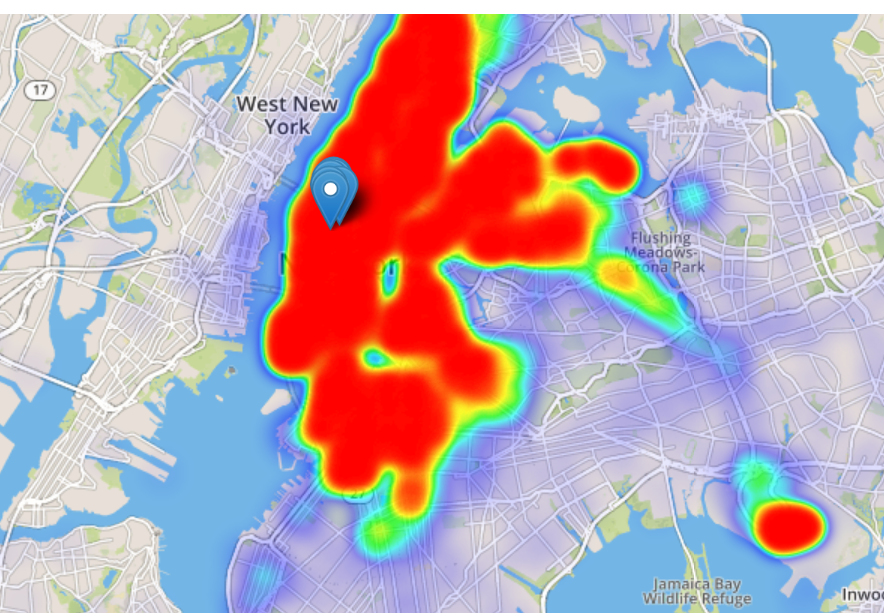
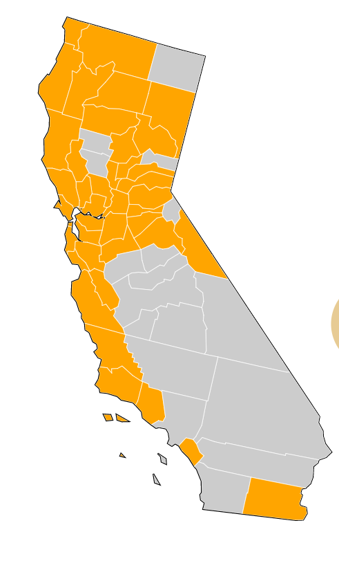
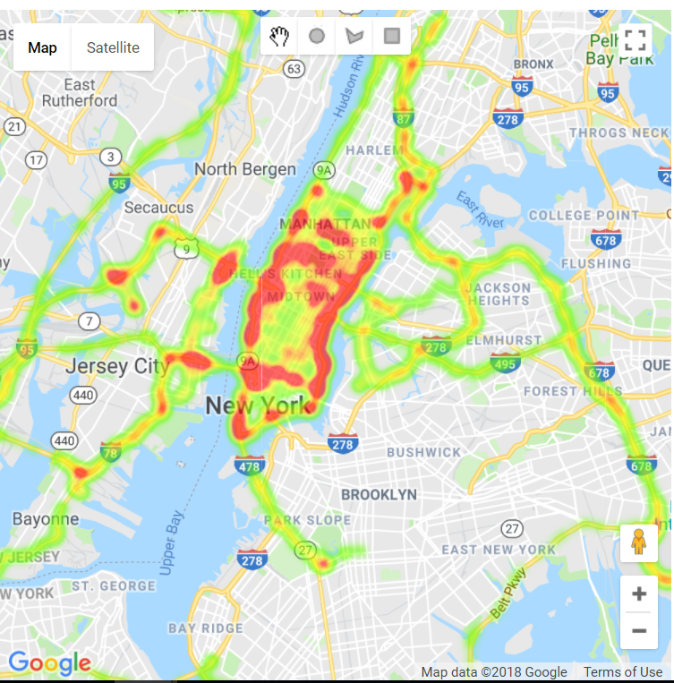
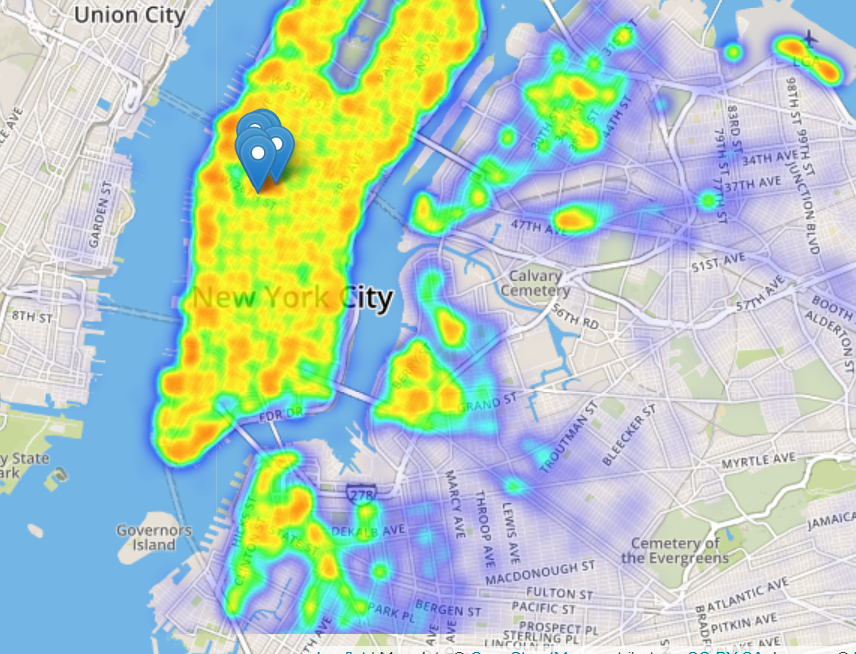
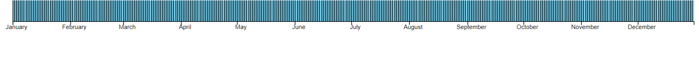
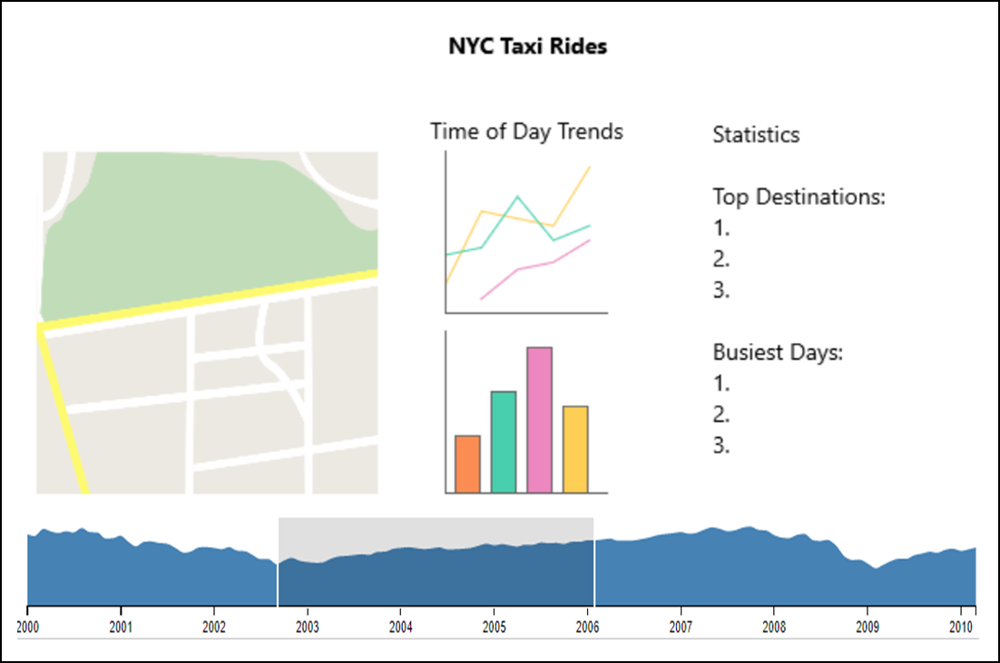
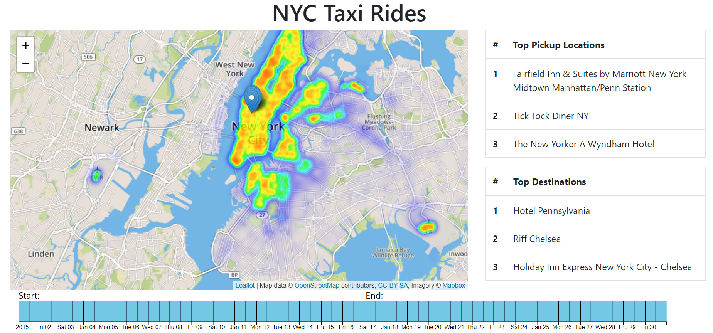

Project Link:

https://bwolfson978.github.io/DataVisFinal/index.html

Overview and Motivation
---
This project’s goal is to interactively visualize taxi rides in New York City. Going into the project, I knew I wanted to work on a project with a large dataset. With most of the online examples and weekly homework assignments in school, it’s rare to get a chance to actually wrangle a large dataset. I knew this was a skill necessary for industry and thought it would prove demystifying to try and work with a dataset of hundreds of gigabytes. Plus, I think this is an interesting topic and was hoping it would yield more nuanced insight into the life of people in New York City.

Related Work
---
My inspiration for this project definitely originated from enjoyment of working with maps. The maps and views assignment was by far my favorite assignment because it felt the most interactive, practical, and useful to people. I believe most people would place maps as one of their favorite types of visualizations. Taxi, Uber, and Lyft data of various sizes and locations has been visualized many times before so there was no shortage of inspiration I could draw from for this project. The two main sources I relied on for inspiration were:

http://toddwschneider.com/posts/analyzing-1-1-billion-nyc-taxi-and-uber-trips-with-a-vengeance/
http://chriswhong.github.io/nyctaxi/

Both of these visualizations came along with informative blog posts that gave me an idea of what it takes to develop a backend capable of servicing hundreds of gigabytes of data through visualizations. The first post also gave me some good ideas as to what trends might be interesting to look at beyond what I had originally conceived in the brainstorming phase.

Questions
---
In my initial brainstorming phase, I started by asking myself the question: “What would I, or someone else, like to know about New York City taxi rides?”. From this question many more arose forming my first list:
1.	Which days of the year are busiest?
2.	Which routes are most popular?
3.	Within a certain geo-fence, which routes are most popular?
4.	Can I see a street view at the most popular pick up and drop off locations?
5.	Which pickup locations are most popular?
6.	Which drop off locations are most popular?
7.	How does traffic throughout the day affect taxi rides?
8.	When and where do the most expensive rides occur?
9.	Which days out of the year did taxi drivers make the most money?

I wasn’t able to answer all of these questions, but they guided my design process. Additionally, once I looked at the structure of the data supplied by the New York City Taxi and Limousine Commission I realized more data was present surrounding each ride than I had expected. Information such as payment type, tip, taxes of various sorts, and passenger count were included for every ride. This led to a couple more design guiding questions:
1.	Has the amount people tip taxis changed over time?
2.	How does tip amount correlate with distance of time of day?
3.	Has the payment type people use to pay taxis changed over time? Does it change depending on the time of day or distance of the ride?
4.	Does average passenger count change depending on the time of day?
5.	How do the prices of trips of varying distance change throughout the course of the day?

Data
---
My data source for this project was one of the published interesting data sets by the Stanford Computational Journalism Lab:

http://www.nyc.gov/html/tlc/html/about/trip_record_data.shtml	

The structure of this data is in excel files around 2GB for each month of data for each taxi vendor (yellow and green). Because of time and complexity constraints, I ended up only using the Yellow Taxi cab data for the year 2015. This still provided ample data (~25GB) to vastly surpass the amount of data a browser can handle.
 
I had read in a few blog posts that people had used heroku, PostgreSQL, PostGIS, and various other backend technologies to host web applications with large amounts of data. This seemed slightly like overkill given the roughly two-week time allotted plus I wasn’t sure it was necessary. After creating a heat map of the first 10,000 rides of January, I realized I was going to have to summarize/aggregate the data somehow. I started doing some background research on how to handle csv files with millions of lines and found two primary strategies: excel data source, and R file chunk reading. Because I wanted to strengthen my technical skills and the data science community seems filled with R gurus, I moved forward with using the R dplyr data wrangling package. I was able to read each of these huge csv files in chunks of 100,000 lines and summarize the data. This included bucketing the data with one row for each hour in a year, averaging a few desired quantitative attributes for this time bucket. This ended up cutting down roughly 25GB to a csv file of only about 10,000 lines. It took some time to get used to the functions offered by dplyr and how to use them together such as filter, group_by, summarize, and mutate. After getting used to them however, I now realize how powerful they are for any data-wrangling related task. Using these tools will be one of the largest learning achievements I take away from this project.

Exploratory Data Analysis
---
My first step in exploring this dataset was generating a quick heat map. I knew I wanted some sort of map to be central to my visualization so this seemed like a good place to start. After getting a quick heat map up and running with the first 100,000 rides of January 2015, I realized some data pruning/summarizing was probably going to be needed. There really doesn’t seem to be many cases where showing every single ride (about 14M per month) in a visualization was going to be necessary. Additionally, I realized in order to successfully determine which pickup and drop off locations were most popular I was going to have to find some way to convert raw lat/lng data to actual human understandable landmarks. It turned out the Google Places API was perfect for this. I could send the API a location and radius and receive a list of locations prioritized by prominence.

After realizing I was going to have to do some data summarizing and aggregation, I turned back to my initial questions for some inspiration on what attributes to address certain tasks. Of the initial questions, I looked more closely at time related trends versus location trends because the map would be able to address most location-based questions. I knew visualizing time of day effects was a feature I wanted to include so I set out to experiment. I first worked on two data attributes: payment type, and tip amount. Because payment type was a categorical attribute with four different types, I had to first filter this data into the rides where the passenger paid with either cash or credit, then mutate and summarize into a derived data attribute for the percentage of rides paid for using credit within a certain time bucket. My initial charts with the first 10,000 rides of January were the following:

I didn’t really know what to think when I first looked at these charts. One helpful aspect was each chart helped me pick out a couple outliers in each range that was throwing off the drawing process. Apparently some person tipped $170 dollars for a taxi ride in January – I wouldn’t have otherwise been able to detect that. I thought there might be some slight upward trend in the degree of credit card payment shown during the start of January so I moved to visualizing both of these trends for all of 2015 and averaged data for each hour of the day to show time of day trends:

	
I was hoping there were going to be more interesting trends on the yearly scale for both of these attributes but really there was just a lot of noise and not much to be gleaned from the user. However, the time of day trends were much more clear. This analysis led me to focus on time of day trends with a timeline for the user to select time ranges rather than show trends for the entire year. One exploratory data analysis technique that stuck out to me throughout the course as very useful was the scatterplot matrix to see correlation. This was something I wanted to try for the different quantitative attributes of each ride but didn’t get the chance to.
	
Design Evolution
---
Throughout the course of my brainstorming and design process, many potential visualization schemes crossed my mind. These included a histogram of number of rides at different hours of the day, stacked bar chart split by green taxi, yellow taxi, and uber, the heat map, providing the ability to draw geofences and filter the heat map, various scatterplots, line charts for time series trends, a radial view of the most popular routes emanating from a particular location, and modes of viewing/selecting time range such as a calendar chart or timeline with brush. This idea brainstormed followed the 5 Design Sheet methodology where design starts by just getting out every possible visualization technique that could potentially apply. A few more I thought of I deemed likely too ambitious such as compound node link diagrams or adjacency matrices with inferred hierarchy from Manhattan neighborhood.

In order to organize all of these potential visualization options, I turned back to the analysis approach style of first beginning with the domain tasks. There were essentially four different categories of tasks at hand: viewing location-based information, viewing interesting statistics such as popular pickup/drop off locations and routes, and viewing time progression on a year scale, and viewing time of day trends. I grouped all the ideas of visualization techniques according to which of these tasks they were addressing. Then I set out to narrow these options down to one or two for each category to simplify the designs. I was quickly able to rule out scatterplots for pretty much any application because of the amount of data points at hand. For the task of viewing location-based information, I had essentially already decided on an interactive map. More decisions regarding the map would come with how to interact with this data however. Options included geo fencing a heat map to filter geographic info, aggregating information by burrough/neighborhood and providing a tooltip/statistics, or giving the user additional filtering capability outside of the map view. I had worked on the neighborhood grouping in assignment four for the counties of California:

I had absolutely no idea if it was possible to combine/overlay this topojson d3 map with interactive maps supplied by mapbox or google maps APIs so I decided to stick with just one of these 3rd party provided maps due to the increased amount of information and interactivity they provide. I chose mapbox over google maps because I think it’s more aesthetically pleasing and allows for overlay of many different types of tiles. Here is a picture of a google maps heat map versus a mapbox and leaflet heat map:

Once the heat map was decided on for visualizing location-based information, I moved onto how to display statistics such as favorite pickup/drop off locations and routes. Some of this information is already implicitly evident through the use of the heatmap but I decided it would be helpful to show the user the names of the landmarks explicitly as well. In order to do this, I show each of the top three pickup and dropoff locations for a given time range in a table to the right of the map. This feature felt useful, but also felt like a dead-end. There wasn’t much to do after getting the results. In order to further engage the user, I decided to show a popup on the map for each of the top three pickup and dropoff locations and provide a tooltip. This draws the user back to the map after they filter time range and allows them to further explore the data such as viewing what other popular locations are close to those pinpointed by the map.

Thirdly, I turned to evaluating the best way to view time. I had initially considered a calendar view with the ability to select a day or month:

This view would be beneficial for selecting a specific day – especially if it was color coded for the amount of rides on that day. Another option I considered was a brush timeline selection:

This mode of viewing time would allow the user to select a time range and do so at a greater granularity with more versatility as well. The weakness would be a decreased focus on the specific day – it might be possible to color code each line based on volume of rides that day but I think that would quickly look like a hairball and it would be difficult to select a single line. My decision ended up being to go with the timeline brush selection for the additional features and interaction it allows and address the day-specific weaknesses by combining it with the time of day charts shown above in the exploratory data analysis. 

Lastly, I considered a couple different options for visualizing the time of day effects. A bar chart for each hour of the day, a line chart for the progression over the course of the day, and a bar chart overlaid with a trend line. I knew from our class that bars are better for comparing data values than trend lines, but the task at hand was summarizing a trend over the course of the day, not necessarily comparing the difference in average tip between 10am and 11am. Additionally, there was already going to be a ride volume histogram present, and I felt more bar charts would just be white noise. For these reason, I chose the line charts.

There were a few other more layout-related design choices I made throughout the course of the project. One included scrapping the year-long trend line charts shown in the exploratory data analysis section because they didn’t provide much value for the end user. Originally, I had planned on having the map on the left side of the screen, with time of day trends and statistics to the right:

The statistics table ended up taking up more space than expected due to certain destinations/pickup locations having very long names and I felt the map wasn’t prominent enough. In order to reconcile these two problems, I decided to just move the time of day trends to the second screen and expand the size of the map. The time of day trends ended up making more sense in the second page in the end because they incorporate data for the entire year along with the ride volume histogram, whereas the heatmap still only incorporates data from the month of January. More specifics on these features can be seen in the implementation section.
	
Implementation
---
My implementation starts off by showing a view of the map of New York City with a populated heat map and top pickup/dropoff locations for the first 100,000 rides in the month of January 2015:

After applying a filter through the brush selection at the bottom of the screen, the heatmap, pickup, dropoff data will be updated to reflect the selected data range:

Hovering over one of the pins in the map will show a tooltip with the name of the location. Scrolling down will show the second main page of the application, time of day trends. Initially the data populating the graphs is for the entirety of 2015:

If the year brush is used to select a more refined data range, this data set will be reflected in the charts:

Evaluation
---
Overall, I am happy with where my project and implementation ended up. Based on the features I set out for the “Minimum Viable Product”, I was able to accomplish all the features except geo-fencing and drawing over the heat map which I decided was relatively low priority. The final implementation is able to answer only a few of the questions I proposed at the outset of the project but the questions it answers are definitely the most important – which pickup and dropoff locations are most popular, what does the general ride volume look like geographically, and time of day trends. I learned from the data that the huge volume of rides and amount of taxis in NYC makes trends and statistics relatively uniform. I was surprised by the low amount of rides between 5am and 7am – this was a time I thought all the people in New York were commuting to work. I also expected the evening rush hour to be less substantial than the morning rush hour because of the variety of activities people tend to do after work which might be either in walking distance or involve different modes of transportation.

There are a few next steps I would take with more time to improve the current visualization. One challenge I thought about was how to visualize the most popular rides. This would likely entail hitting the Google Maps API for the polyline between two points and adding these points of the polyline to the heat map or creating an additional “routes” heat map layer. Given the amount of points already present on the heat map, I didn’t try this. I’m not exactly sure how one would summarize the geographic data similarly to how I grouped and summarized the quantitative data in time buckets. I guess it might be possible to just take every 100th data point but this would obviously not preserve the structure of the data uniformly. Additionally, I could incorporate a traffic layer into the map by hitting the Google Maps Traffic API or add another line overlaying the histogram of ride volume with traffic to answer the question of how traffic throughout the day affects taxi rides. Given more time I also would have pre-processed more years of data using R. This would have allowed for more robust charts as well as further possible identification of interesting trends.

Two of my biggest goals with this project were learning to work with larger amounts of data as well as applying an increased focus on the design aesthetic of the project. I think I accomplished the former by learning how to wrangle data with R dplyr and summarize a whole year of data from roughly 25 gb to 500kb. This made the difference between needing to use a server and database versus allowing the browser to handle the data. Additionally, I used the bootstrap grid system for page layout and styling which was interesting to learn. This led to my final design being much more structured and visually appealing than some of my previous assignments where I focused more on functionality of a visualization than overall design of the page itself.

