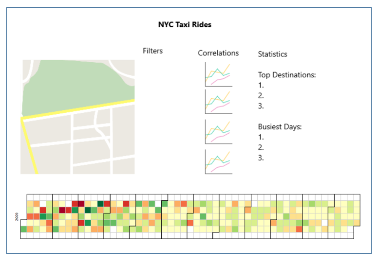
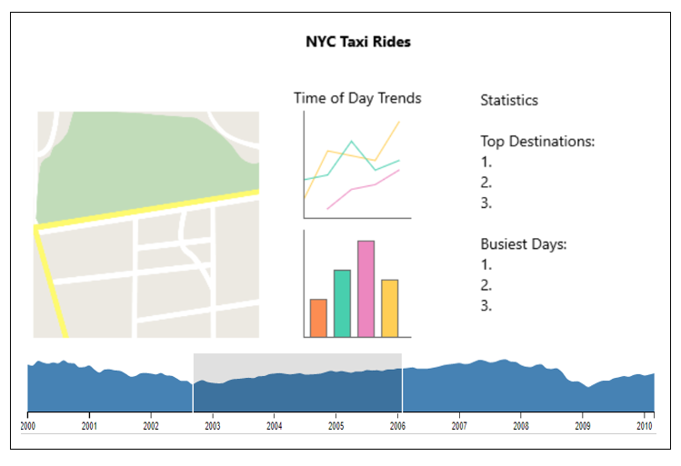
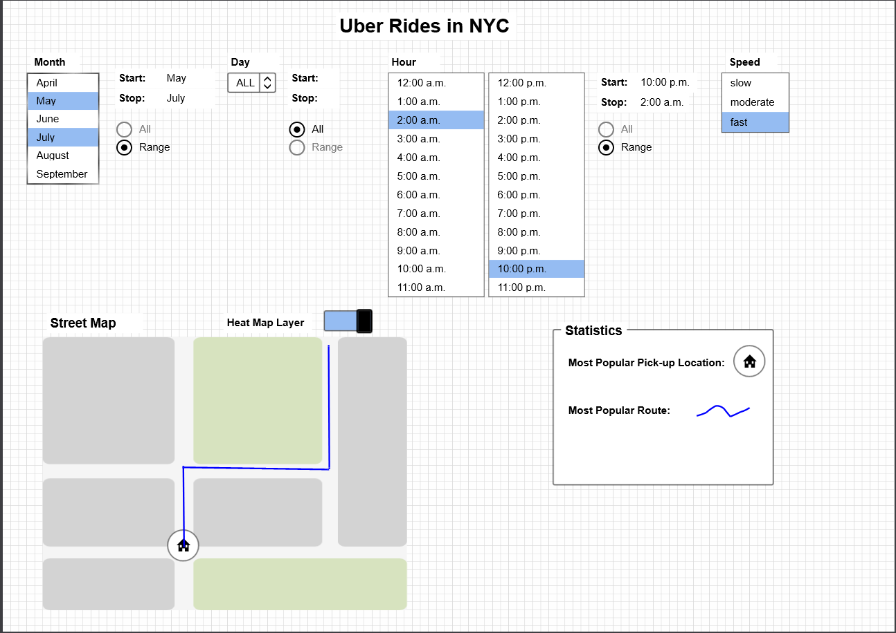

Project Proposal
===

Basic Info
---
Barrett Wolfson

bwolfson@wpi.edu

NYC Taxi Rides

Background and Motivation
---
I was totally unsure what to do for my final project. Throughout the course students have seen numerous examples of interesting datasets and data visualizations on those sets. After sifting through a few possible ideas, I settled on visualizing taxi ride data in New York City.

Given the time constraints of a 7-week quarter, I knew gathering my own data through an empirical technique such as surveying wasn’t going to be feasible. I considered a few different project ideas that occurred to me throughout the course: visualizing the careers of WPI computer science students after graduation, visualizing the gut microbiome, visualizing standardized test scores across the country, and a couple others. Looking at career trends of WPI students would require working with the Career Development Center to hopefully obtain some data reported back to them annually by alumni. I was weary of the completeness or accessibility of this data. A more biology focused option, looking at the gut microbiome was a random idea I had while talking to my mom about a book on the topic she recently started reading. Apparently there’s specific gut bugs that are heavily correlated with medical issues such as obesity and Alzheimer’s. I thought this would make an excellent exploratory data visualization project but would require more domain expertise. Analyzing standardized test scores across the country originated from the data set I used in assignment 4 on California SAT scores. This would’ve been a straightforward continuation but I wanted to my hand at a new dataset. After nixing the aforementioned ideas for the stated reasons, I turned to the Stanford Computational Journalism Lab’s recently published interesting data sets. While browsing through, the data set with the past five years of New York City’s taxi ride data stuck out to me. It was familiar because I had actually worked on a similar project visualizing Uber ride data in NYC a year ago as part of an interview for the Advanced Technology Center at Uber. I wasn’t able to get to a satisfying stopping point with this project partially because of my inexperience handling raw data at the time. I have wanted to return to the project since then and this seemed like a great opportunity to take it a few steps further. Additionally, I knew I wanted to do something with geographic data because maps are probably my favorite kind of visualization and this project lends itself nicely to a map-centered visualization design.

Project Objectives
---
I started the brainstorming phase of this project by thinking of interesting questions I would like to ask regarding NYC taxi data. The following is the list of questions I came up with:
1.	Which days of the year are busiest?
2.	Which routes are most popular?
3.	Within a certain geo-fence, which routes are most popular?
4.	Can I see a street view at the most popular pick up and drop off locations?
5.	Which pickup locations are most popular?
6.	Which drop off locations are most popular?
7.	How does traffic throughout the day affect taxi rides?
8.	When and where do the most expensive rides occur?
9.	Which days out of the year did taxi drivers make the most money?

Regarding the value proposition of this visualization, I think most of the value is potentially entertaining and interesting trend presentation. It’s possible that the visualization surfaces information worth acting on for some people such as sharp peaks or drops in ride volume at certain times of the day. Taxi drivers would certainly like to look at the data visualization to see if the data matches their own experience and potentially optimize their schedule accordingly – avoiding peaks, focusing on high-tip times and days. But overall, I expect the data to be relatively uniform because of the constant activity in NYC. Many people would find it interesting to interact with the data visualization and gain insight into the lifestyle habits of those using taxis for transportation in NYC by viewing information such as the top destinations and most frequently travelled routes.

Data
---
http://www.nyc.gov/html/tlc/html/about/trip_record_data.shtml

The data used in this project will be taken from the New York City Taxi and Limousine Commission. Due to the size of the data set, it will most likely be necessary to set up a server and database to handle the data. I’ve never set up a full-stack web application with large amounts of data before so I think this will be a great learning experience. It is another one of the reasons I chose this project. There are many resources online regarding amassing and congregating large data sets for me to refer to when I get stuck.

Data Processing
---
I’m not totally sure if any data cleanup will be necessary or how to answer that question without seeing all the data records. I downloaded a portion of the data as an excel file and looked at samples of all the data values. I think the largest cleaning/manipulating I’ll have to do is convert a “location ID” into latitude and longitude. The location must be something specific to New York City in which case I think there will hopefully be an easy way/possibly an API to map the ID into lat/lng data.

For derived data attributes, I think the most important transformation I’ll have to do is obtaining the concept of a route. I think it is possible to obtain the waypoints of a trip given a starting and ending location which are essentially latitude/longitude points along the route between the start and finish. This data will be necessary to construct the heat map layer of the visualization. Another possible derived attribute would be the speed of a trip. Given the distance of the route and the pickup and drop off times, it would be possible to construct the speed value. Filtering by speed might be something useful to an end user.

Visualization Design
---
Design Option 1:

Design Option 2:

Design Option 3:

Final Design
---
My final design choice is essentially design 2 with a few added features. Next to each of the top destinations would be a dialogue giving the user the opportunity to light up the location on the map to the left. Additionally, a dropdown selection on the left of the bottom timeline would allow the user to see data from different years.

Design Justification
---
Throughout the design process, I tried to think about the pros and cons not only of each of the above design options but also the constituent visualizations. I quickly decided the first visualization to make it into the final design was the interactive map with a heat map layer toggle. This is probably the centerpiece and focus point of the dashboard as a whole. The ability to search, browse, or identify locations is most easily accomplished with an interactive map. The ability to select specific regions can be accomplished with the heat map layer. The next design choice I had to make was how to give the user the ability to filter by time. I decided the more important/prominent time filter would be on the longer annual/monthly scale rather than hours of the day. I came up with two potential modes of accomplishing this including the classic GitHub commit calendar view and a continuous timeline with a brush selection. The upsides of the calendar view include the ability to easily select a specific day since it is just one square. This also gives an easy opportunity for a tooltip with statistics about the day that aren’t already shown to the right of the dashboard. It also provides a simple way to introduce a visually aesthetic color scale. Additionally, I think developers like this view because it makes them think of GitHub. The downsides include greater difficulty viewing annual/monthly trends. For the timeline with the brush selection, the upside includes a more visible trend and the opportunity for increased user interaction with the brush. The downside includes greater difficulty selecting a day but this can be mitigated by displaying labels with the current range selection and allow for the granularity necessary to select one day in the range. After thinking about my audience and users as well as the goal of the dashboard to show trends, I opted for the timeline with brush shown in design 2. I decided it belonged on the bottom of the screen to give the user context and to minimize scrolling. The next design decisions included what other charts and information to display in the remaining space on the layout. Of the questions I initially generated, the ones left included time of day trends, the busiest days of the year, along with the most popular destinations and routes. I decided to leave out the potential of a scatterplot matrix shown in design one purely because I decided this is more of an intermediary visualization technique I could do with R on the way to discovering correlation and which attributes to include in time of day trend charts in the final dashboard. Displaying the top destinations and routes didn’t involve much debate because I couldn’t think of many other ways to display them aside from a ranked list

Must-Have Features
---
1.	Google map populated with data in the form of a heat map layer
2.	Interactive geo-fence drawing and corresponding filtering of statistics
3.	Timeline with brush selection at bottom of screen with corresponding filtering of data set based on selected time range.

Optional Features
---
1.	More than one year of data – year selection at right of timeline
2.	Option for other statistics – dropdown at bottom of statistics with statistics such as busiest days, most expensive days, or other quantitative attributes from the data.
3.	Adding Uber or Lyft additional ride data.
4.	Highlighting of specific routes on the map.

Project Schedule
---
Week 1: Server and database set up able to process and store the data. This will be the biggest challenge (I think) given the size of the dataset, 276 GB.

Week 2: Dashboard components in place with initial/default data

Week 3: Interactivity of components and polish of design. I think I can do this with d3.dispatch such as in Assignment 4 but I’m not sure how this scales with a large data set.
	